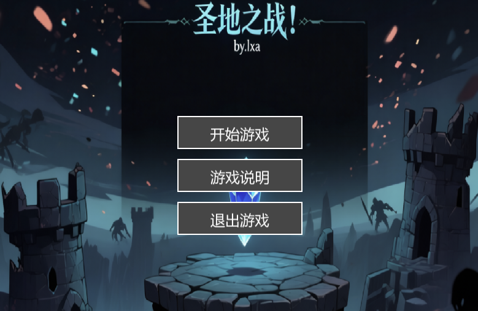
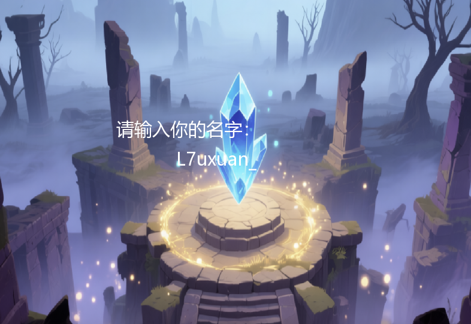
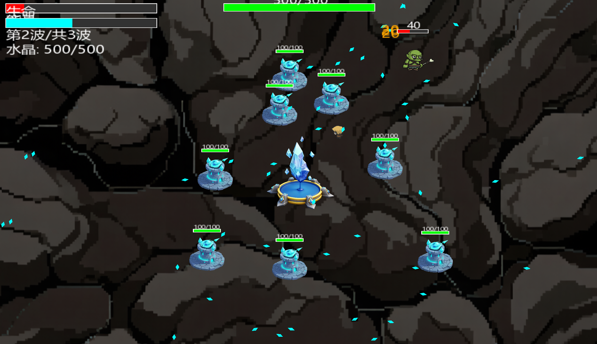

<div align="center">
  
# **SurvivalGameDemo**
  
## *2D生存游戏 | 塔防 + 射击混合*


[](https://github.com/L7uxuan/SurvivalGameDemo/stargazers)
[](https://github.com/L7uxuan/SurvivalGameDemo/network)

</div>

> 一款融合了塔防与射击玩法的2D生存游戏  
> 控制步枪手，建造防御塔，在敌人潮中保护水晶核心

---

## 📖 目录

 [✨ 游戏特色](#-游戏特色)  
 [🎮 操作说明](#-操作说明)  
 [📷 游戏截图](#-游戏截图)  
 [🚀 快速开始](#-快速开始)  
 [🛠️ 技术栈](#-技术栈)  
 [📁 项目结构](#-项目结构)  
 [📜 许可证](#-许可证)  
 [🙏 致谢](#-致谢)  

---

## ✨ 游戏特色

 **混合玩法** —— 塔防 + 射击双核机制，策略与操作并重  
 **智能仇恨系统** —— 谁攻击敌人，敌人就会优先追击谁  
 **子弹反弹** —— 所有子弹碰到屏幕边缘可反弹，且最多反弹2次  
 **防御塔系统** —— 消耗能量建造自动攻击的防御塔，射速5发/秒  
 **复活机制** —— 玩家死亡3秒后在起点复活，清除仇恨  
 **波次预告** —— 每波来袭前屏幕中央显示预告，间隔5秒  
 **血包掉落** —— 敌人有5%几率掉落血包  
 **丰富特效** —— 近战挥砍、冲刺拖尾、伤害数字、血条系统  

---

## 🎮 操作说明

| 按键 | 功能 |
| :--- | :--- |
| `WASD` | 移动角色 |
| `鼠标左键` | 射击 |
| `鼠标右键` | 冲刺 |
| `X` | 建造防御塔/30能量 |
| `␣` 空格 | 暂停游戏 |
| `↵` 回车 | 推进剧情 |

---

## 📷 游戏截图

### 战斗场面



*菜单界面展示*

---

### 防御塔系统



*剧情界面展示*

---

### 波次预告



*游戏界面展示*

---

## 🚀 快速开始

### 环境要求

 **操作系统**：Windows 10 / 11  
 **开发工具**：Visual Studio 2022  
 **图形库**：SFML 2.6.1  
 **编译器**：支持 C++17  

### 编译与运行

1. **克隆仓库**

   ```bash
   git clone https://github.com/L7uxuan/SurvivalGameDemo.git
2.**打开项目**

   用 Visual Studio 2022 打开 SurvivalGame.sln

3.**配置 SFML**

   确保 SFML 2.6.1 的 include 和 lib 路径已正确配置

4.**编译运行**

   按 F5 编译并运行游戏

---

## 🛠️ 技术栈

[](https://isocpp.org/)
[](https://www.sfml-dev.org/)
[](https://visualstudio.microsoft.com/)
[](https://git-scm.com/)

### 核心技术

- **语言**：C++17
  - 使用面向对象编程（OOP）
  - STL容器管理游戏对象
  - 智能指针管理资源

- **图形渲染**：SFML 2.6.1
  - 2D图形渲染
  - 动画序列帧播放
  - 粒子特效系统

- **开发工具**
  - Visual Studio 2022
  - Git 版本控制
  - GitHub 代码托管

---

## 📁 项目结构

```
SurvivalGameDemo/
├── SurvivalGame.sln              # Visual Studio 解决方案
├── README.md                     # 项目说明文档
├── score.txt                     # 最高分记录
├── .gitignore                    # Git忽略文件
│
├── SurvivalGame/                 # 源代码目录
│   ├── main.cpp                  # 主程序入口
│   ├── Player.h                  # 玩家类声明
│   ├── Player.cpp                # 玩家类实现
│   ├── Enemy.h                   # 敌人类声明
│   ├── Enemy.cpp                 # 敌人类实现
│   ├── Bullet.h                  # 子弹系统
│   ├── Tower.h                   # 防御塔系统
│   ├── Crystal.h                 # 水晶核心
│   ├── HealthPack.h              # 血包系统
│   ├── DamageNumber.h            # 伤害数字特效
│   ├── SlashEffect.h             # 近战特效
│   ├── TrailParticle.h           # 冲刺拖尾粒子
│   ├── HealthBar.h               # 血条系统
│   └── EnemyHealthBar.h          # 敌人血条
│
└── assets/                       # 游戏资源
    ├── background.png            # 游戏背景
    ├── menu_bg.png               # 菜单背景
    ├── story_bg.png              # 剧情背景
    ├── crystal.png               # 水晶贴图
    ├── tower.png                 # 防御塔贴图
    ├── Rifleman/                 # 玩家动画
    ├── landmaster/               # 陆地敌人动画
    └── Flyingmaster/             # 飞行敌人动画
```

---

## 📜 许可证

本项目采用 **MIT 许可证**。

你可以自由地使用、修改、分发本项目，但需保留原始版权声明。

---

## 🙏 致谢

* **[SFML](https://www.sfml-dev.org/)** —— 简单易用的多媒体库，为游戏提供图形、窗口和输入支持
* **Visual Studio 2022** —— 强大的 C++ 开发环境
* **所有开源社区** —— 提供了宝贵的学习资源和灵感
* **每一位试玩的朋友** —— 你们的反馈让游戏变得更好

---

⭐ 如果喜欢这个项目，欢迎给个 Star 支持一下！
